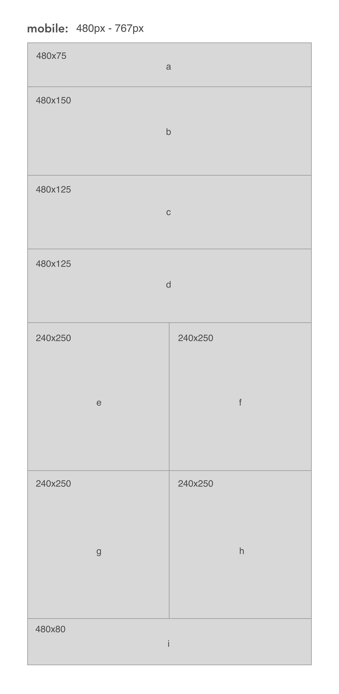
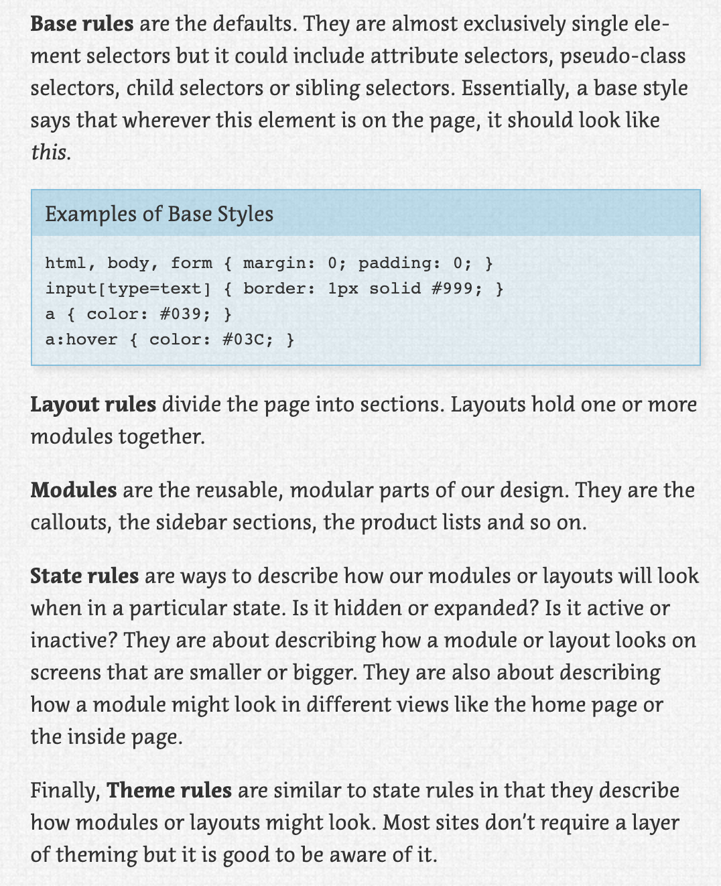

# lab-01
SMACCS and RWD

I did some funky math to account for the borders where they occur (0.5px)

Instructions: 
+ match wireframes below
+ Use good HTML structure to scaffold this site, using semantic elements where possible.
+ Container elements (a box outside of your content box that might contain multiple content boxes) are very useful in managing layout. You will need to think about the relationship between parent and child / descendant elements as well as the order in which you place them in the HTML. Be thoughtful about your layout strategy.
+ Add a reset.css file to your project.
+ Use SMACSS-style modularity to organize your CSS.
+ Style the page using float-based layout to reflect the comp images provided as closely as possible. The only text you should have in each box is the identifying letter, which should be centered horizontally and vertically.
+ For the desktop view, the content should be inside of a channel that is a maximum of 960 pixels wide and is centered on wider screen sizes.
+ Each box should have a unique background color in mobile view and in desktop view. We are not working with jQuery events yet, so these changes should be observed when the screen size changes and the page is refreshed.

Stretch: 
+ Create an additional breakpoint for a new set of colors when the page is viewed on a tablet.
+ Use jQuery to change the color of each box based on the screen size.

desktop:

mobile:

SMACCS rules:

